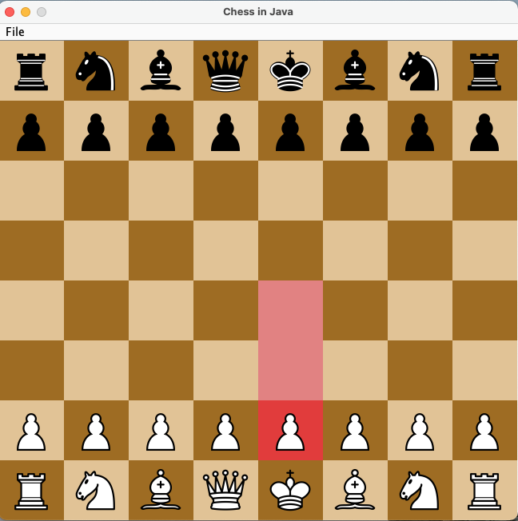

# Chess in Java
The classic game of chess made using OOP coded completely in Java. This project uses Java Swing to create a clickable GUI.

Currently, you play as white against a computer that randomly selects a legal move. If you have ever played chess you should have no trouble winning. In fact it is probably harder to lose against the computer than to win. 

## How to Run 
1. .jar file (Java must be installed)
	- Download "Chess_in_Java.jar" [Link to file](https://github.com/alexboden/chess-in-java/blob/master/Chess%20NetBeans%20Source/dist/Chess_in_Java.jar)
	- Naviagate to correct folder in terminal/command line
	- Use the command ```java -jar "Chess_in_Java.jar"``` to execute to file
2. NetBeans
	- Open folder "Chess NetBeans Source" in Apache NetBeans
	- Run the project

## Photo of GUI when e2 pawn is selected


## Features Implemented
- Regular piece movement ensuring every move is legal
- Castling
- En Passant 
- Checkmate 
- Stalemate when a player has no legal moves
- When a piece is clicked (assuming it is that colour's turn) it will highlight the legal moves for that piece

## Features Not Yet Implemented
- 50 move rule
- Stalemate due to insufficient material

## Bugs
- When File -> New Game is selected after stale/checkmate the boardpanel gets slightly cut off
